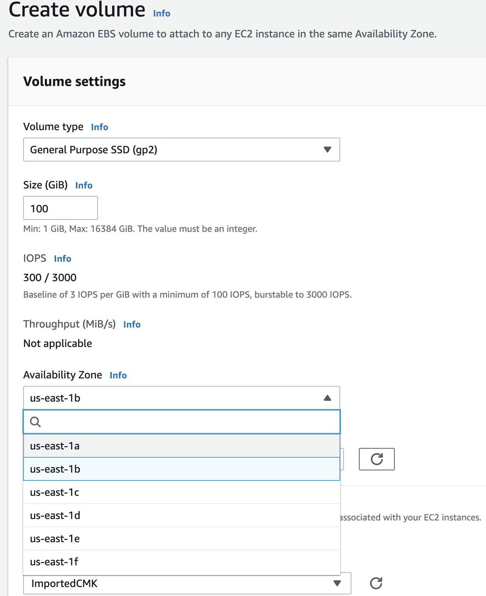
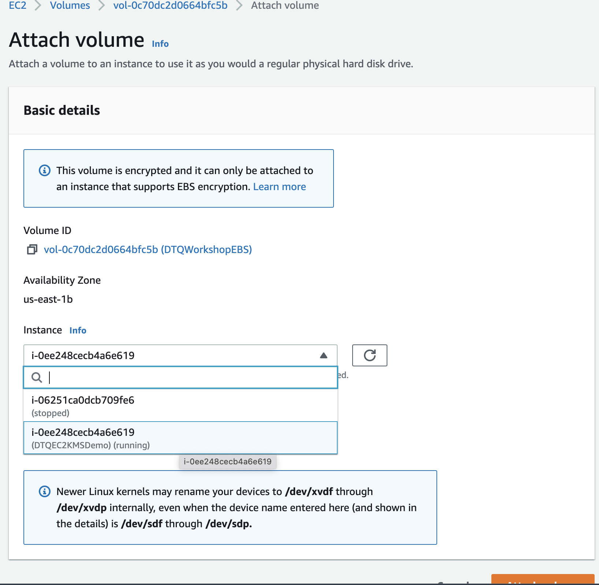
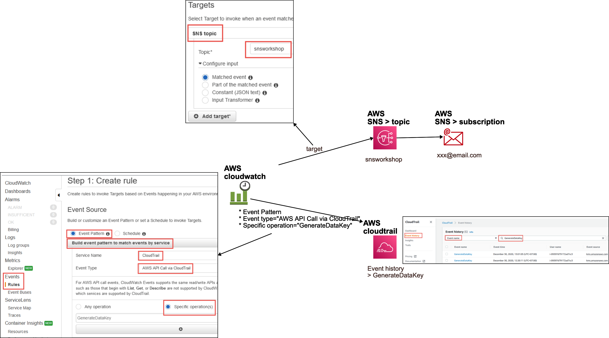

# aws-kms-cformation-demo 🐳


[](https://github.com/tquangdo/aws-kms-cformation-demo/issues/new)

## reference
[awsstudygroup](https://000033.awsstudygroup.com/vi)

## 2.3 Thực hiện Rotating AWS KMS CMK
- NOT practice with CMK External!

## 2.4 Xóa bỏ AWS KMS CMKs
### FirstCMK
- CMK's status change to `Pending deletion`
### ImportedCMK (External) (NOT practice!)
- CMK's status change to `Pending import` ->  `Pending deletion`

## 3.2 Mã hóa phía Server
- create EBS name=`DTQWorkshopEBS`
- select AZ that same with EC2's AZ (Ex: `us-east-1b`)
- select KMS key=`ImportedCMK` 

- click `Attach volume` > select EC2 that has the same AZ

- run CMD will see attached volume `xvdf`
```shell
lsblk
->
NAME    MAJ:MIN RM  SIZE RO TYPE MOUNTPOINT
xvda    202:0    0    8G  0 disk 
└─xvda1 202:1    0    8G  0 part /
xvdf    202:80   0  100G  0 disk
```

## 3.2 Mã hóa phía Client
`script.sh` > "3-mã-hóa-file-text-encryptedSecret"

## 5 Giám sát việc sử dụng AWS KMS


## the end
- just practice until this of `script.sh`, the remains please follow ## reference
```shell
sudo python3 WebApp.py 80
```

## delete AWS resources
`./del_aws_resource.sh`
